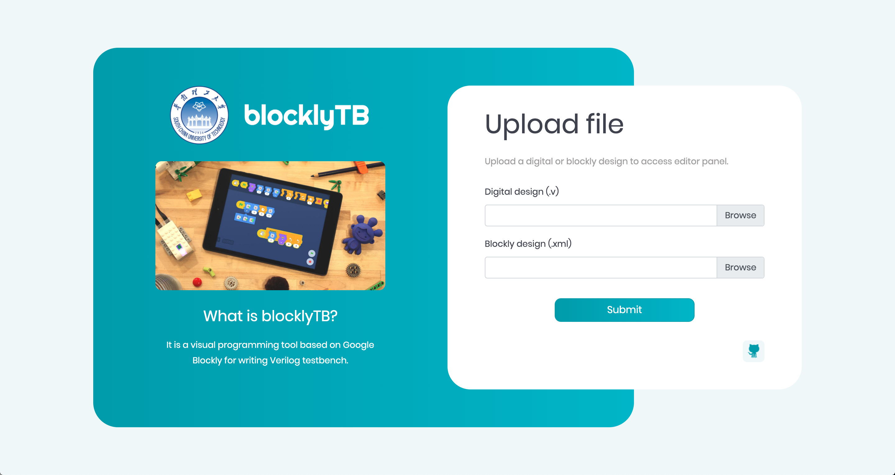

# blocklyTB #

blocklyTB is a visual programming tool for writing Verilog testbench. 
It is based on the secondary development of Google Blockly and assists learning FPGA for educational purposes.

 

## [Visit online](https://yasminyt.github.io/blocklyTB/)

You can access and use it [online](https://yasminyt.github.io/blocklyTB/), 
but first make sure that you already have the FPGA design file (file ending in .v) or 
the xml design file exported by blocklyTB.

You can also save the [link](https://yasminyt.github.io/blocklyTB/) as a favorite for future visits.

Of course, you can also get the [source code](https://github.com/yasminyt/blocklyTB) locally, 
visit blocklyTB/index.html in your browser to use.

## Features ##
Theses are the main features of blocklyTB:

- Supports most Verilog syntaxes, enabling basic testbench design.
- Supports automatic DUT instantiation. Just upload the completed FPGA design (only Verilog language is supported), 
  blocklyTB will automatically complete the instantiation process required by the testbench.
- Supports to save the design of blocklyTB locally. you can import it again to continue the design next time.
- Can create different types of variables, such as reg, wire, parameter, localparamter, integer, etc.
- Implemented encapsulation and reuse of the task.
- blocklyTB adds several system functions commonly used in Verilog, such as $ time, $ monitor, $ random, etc., 
  and common file I/O functions.
- Generate corresponding Verilog code in real time and display it in format, which can be copied or downloaded.
- Some other features provided by [Google Blockly](https://developers.google.com/blockly/).

